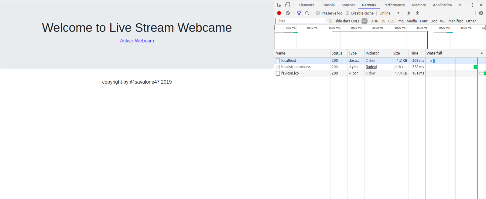
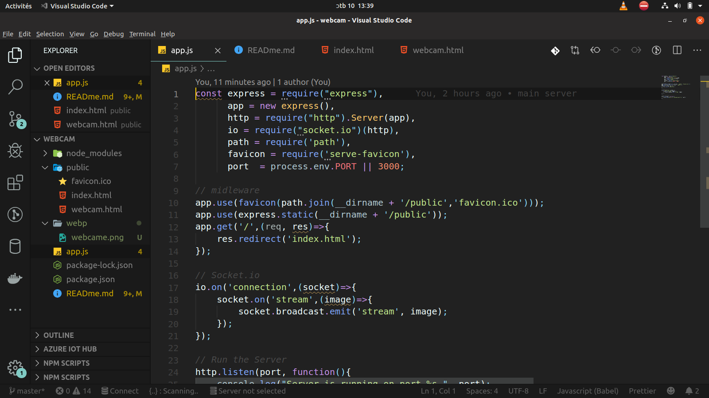

# WebCame.io

socket.IO enables real-time, bidirectional and event-based communication.<br>
It works on every platform, browser or device, focusing equally on reliability and speed.<br>
[Socket.io/docks](https://socket.io/docs/)




# screenshort of the code



### Included

- [NodeJs] 
- [Express]
- [Socket.io]

```
io.on('connection', function(socket){
  socket.emit('request', /* */); // emit an event to the socket
  io.emit('broadcast', /* */); // emit an event to all connected sockets
  socket.on('reply', function(){ /* */ }); // listen to the event
});
```

### Quick start

```bash
# clone the repo
git clone https://github.com/savalone47/WebCame.io.git

cd WebCame.io

# Install the dependencies:
npm install

# start the server
npm start
```

## Author

[Savalone47](https://github.com/savalone47/WebCame.io)
